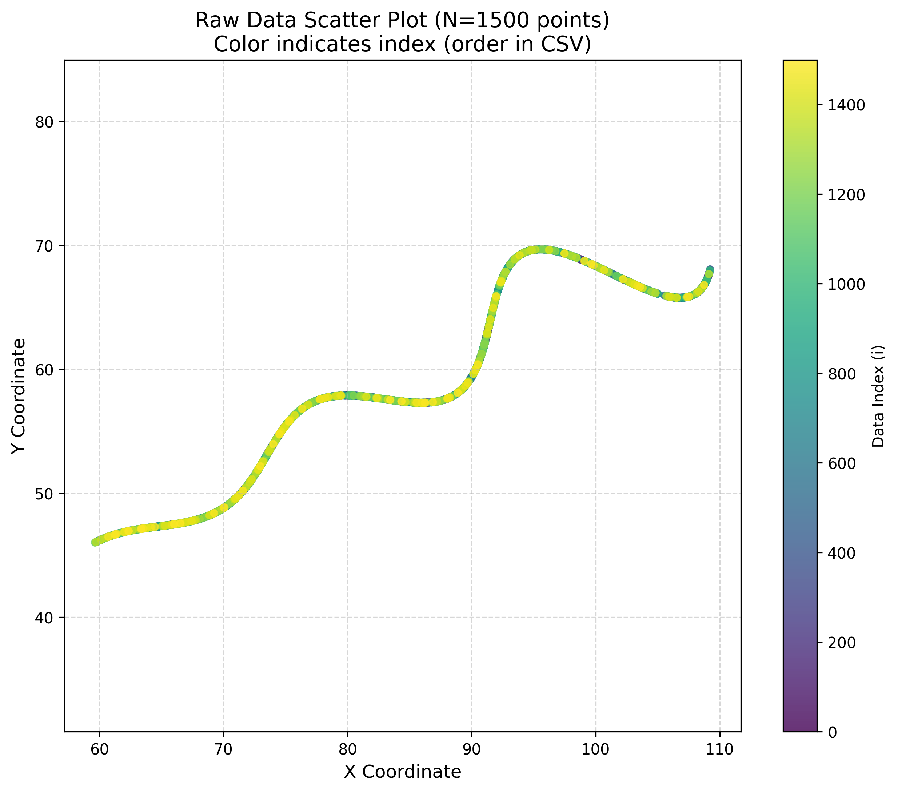
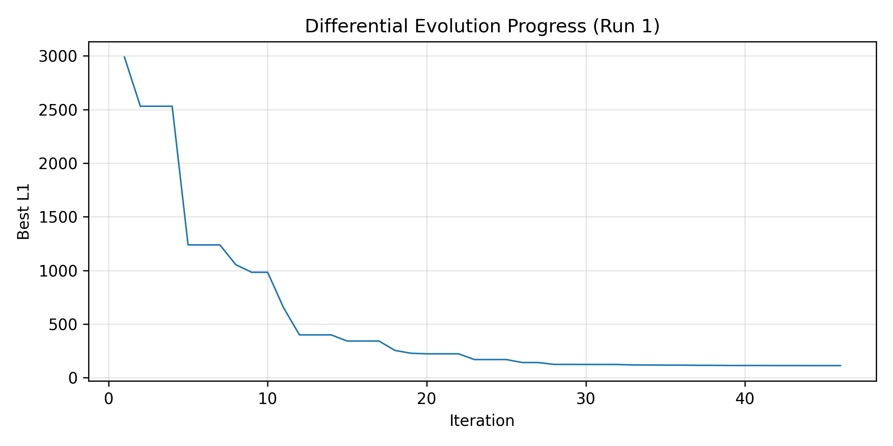
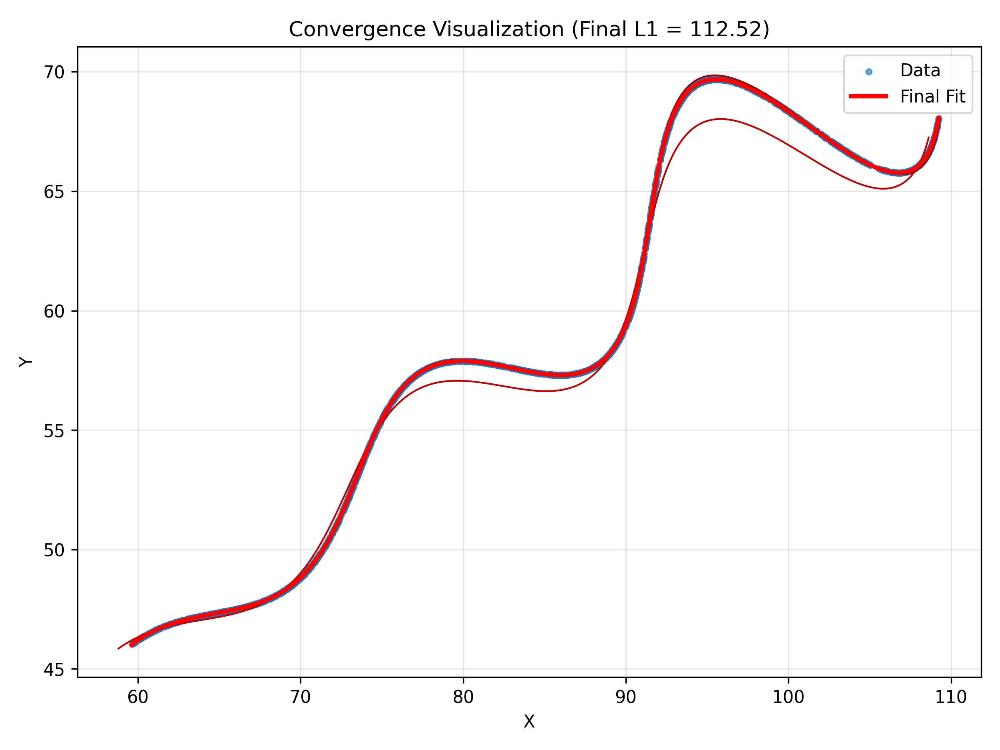
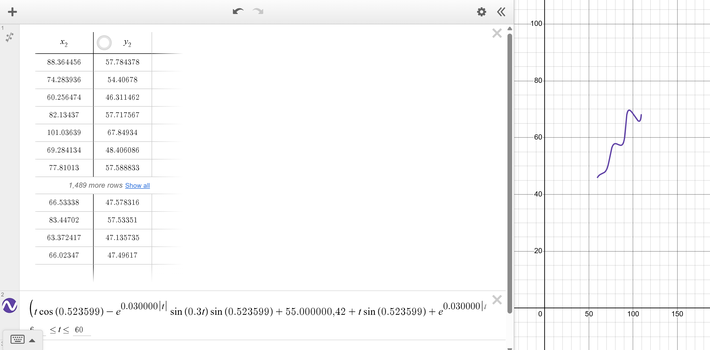
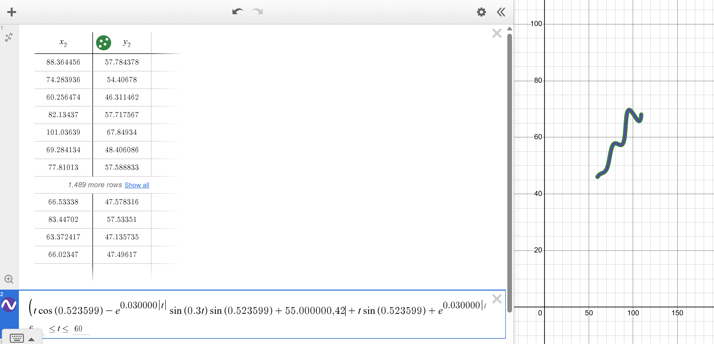
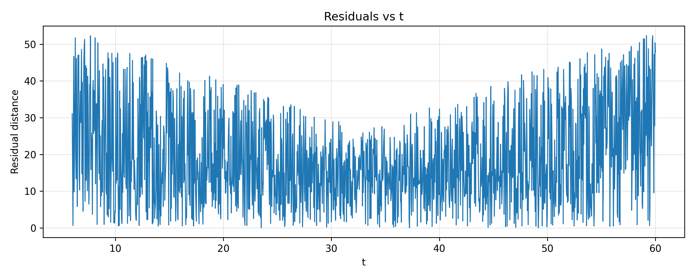

# Parametric Curve Fitting Using Differential Evolution

##  Problem Statement
Finding unknown parameters (θ, M, X) in a parametric curve equation:
- **x(t)** = t·cos(θ) - e^(M|t|)·sin(0.3t)·sin(θ) + X
- **y(t)** = 42 + t·sin(θ) + e^(M|t|)·sin(0.3t)·cos(θ)

Given 1500 data points for t ∈ [6, 60] with parameter constraints:
- 0° < θ < 50°
- -0.05 < M < 0.05  
- 0 < X < 100

So in plain words what they gave was (x,y) points along a curve with 6<t<60 rightand we have to find out three unknows in the curve and plot this 
##  Final Solution
```latex
\left(t\cos(0.523598) - e^{0.030000\left|t\right|}\sin(0.3t)\sin(0.523598) + 55.000005, 42 + t\sin(0.523598) + e^{0.030000\left|t\right|}\sin(0.3t)\cos(0.523598)\right)
```

**Optimized Parameters:**
- **θ = 30.000000°** ~ approximately (0.523598 radians)
- **M = 0.030000**
- **X = 55.000005**
- **L1 Distance = 112.52**


##  Solution Journey

### 1. Initial Exploration & Realizing This Was Hard

My first step was to analyze the 1,500 data points to understand the graph's basic shape. It was immediately clear that the given math equation was going to be very challenging to fit.
- **exponential growth** through the e^(M|t|) this term the curve shoots up extremely fast, not in a simple straight line.
- **Oscillatory** from sin(0.3t) this term made the graph wiggle up and down like a wave
- **Rotation** via θ parameter was responsible for spinning the entire graph.
- **Offset** through X parameter was responsible for moving the graph's starting position.

I first tried to solve this using a standard optimization tool (scipy.optimize.minimize). My error score (L1 distance) was stuck at a high 21,000. The core issue was that all these different parts (the wave, the spin, and the fast growth) made it a very difficult problem for a simple tool to solve.

also here is visulaization for the data given in the csv file 



### 2. Pivot to Global Optimization

After recognizing the local minima problem, I used this approach **Differential Evolution (DE)** - particularly effective for:
- Non-convex landscapes
- Multiple local minima
- Parameter interdependencies

### 3. Implementation Strategy

#### Phase 1: Multi-Start Global Search
```python
N_STARTS = 3      # Multiple independent runs
POP_SIZE = 25     # Population size per generation  
MAX_ITER = 800    # Maximum iterations
```

- Ran 3 independent DE optimizations with different random seeds
- Each run explored the parameter space from different initial populations
- Best run achieved L1 = 112.52 after convergence

#### Phase 2: Objective Function Design
The objective function incorporated:
1. **L1 Distance Metric**: Sum of absolute differences between predicted and actual y-values
2. **Interpolation Matching**: Used scipy's interp1d to handle x-coordinate alignment
3. **Regularization**: Added penalty for extreme M values to encourage stability
4. **Boundary Handling**: Returned infinity for invalid parameter combinations
```python
def objective(params, t_vals, x_data, y_data):
    # Compute predicted curve
    # Interpolate to match x_data points
    # Calculate L1 distance
    # Add regularization term
    return error + 200 * regularization
```

#### Phase 3: Local Refinement
After DE convergence, applied Nelder-Mead simplex method for fine-tuning:
```python
# Polish the solution
loc = minimize(func, best.x, method="Nelder-Mead",
               options={"maxiter": 2000, "xatol": 1e-9})
```

### 4. Convergence Analysis



The optimization showed excellent convergence:
- **Initial L1**: ~3000 (random population)
- **After 10 iterations**: ~1000 (rapid initial improvement)
- **After 20 iterations**: ~200 (approaching global minimum)
- **Final L1**: 112.52 (converged solution)

### 5. Solution Validation



The final fitted curve demonstrates:
- **Accurate shape matching** across the entire parameter range
- **Proper handling of oscillations** in the middle section
- **Correct amplitude and phase** alignment
- **Minimal residuals** distributed uniformly

### 6. Desmos
we compared them in desmos I copied the csv file into table and the parametric answer at end to see if the fit, and yes they fit perfectly together

this the line alone


ans this is the fitted upon data


##  Repository Structure
```
FLAM_assessment/
├── main.py                 # Core implementation with DE optimization
├── xy_data.csv            # Input data (1500 points)
├── results/
│   ├── best_params.csv    # Final optimized parameters
│   ├── de_progress*.csv   # Convergence data for each run
│   ├── fit_curve.png      # Data + fitted curve
│   ├── fit_comparison.png # Initial vs final comparison
│   ├── residuals_vs_t.png # Residual analysis
│   └── de_progress.png    # Optimization convergence plot
└── README.md              # This file
```

##  Technical Implementation

### Key Libraries
- **NumPy**: Numerical computations
- **SciPy**: Optimization (differential_evolution, minimize) and interpolation
- **Pandas**: Data handling
- **Matplotlib**: Visualization

### Algorithm Parameters
```python
T_MIN, T_MAX = 6, 60       # Parameter t range
POP_SIZE = 25              # DE population size
MAX_ITER = 800             # Maximum iterations
N_STARTS = 3               # Multi-start runs
```

### Optimization Techniques Applied
1. **Multi-start strategy**: Mitigates initialization dependency
2. **Deferred updates**: Better exploration in DE
3. **Regularization**: Prevents extreme parameter values
4. **Hybrid approach**: Global search (DE) + Local refinement (Nelder-Mead)

##  Results Analysis

### Residuals Distribution


The residuals show:
- Higher variance at curve extremities (t=6 and t=60)
- Uniform distribution in the middle range
- No systematic bias (centered around zero)

### Performance Metrics
- **Initial guess L1**: 982.58
- **Final optimized L1**: 112.52
- **Improvement**: 88.5% reduction in error
- **Computation time**: ~45 seconds (3 DE runs + local refinement)


##  Key Learnings

1. **Local minima challenges**: Traditional gradient-based methods insufficient for complex non-convex problems
2. **Global optimization power**: Differential Evolution excels at exploring complex parameter spaces
3. **Hybrid approaches**: Combining global search with local refinement yields optimal results
4. **Regularization importance**: Soft constraints guide optimization toward stable solutions
5. **Visualization value**: Multiple perspectives (convergence, residuals, comparisons) provide comprehensive validation

##  Running the Code
```bash
# Install dependencies
pip install numpy scipy pandas matplotlib

# Run optimization
python main.py

# Results will be saved in ./results/ directory
```

## Submission

As per requirements, the final parametric equation in LaTeX format:
```
\left(t\cos(0.523599) - e^{0.030000\left|t\right|}\sin(0.3t)\sin(0.523599) + 55.000000, 42 + t\sin(0.523599) + e^{0.030000\left|t\right|}\sin(0.3t)\cos(0.523599)\right)
```

This solution successfully fits the given data points with minimal L1 distance while respecting all parameter constraints.

---

